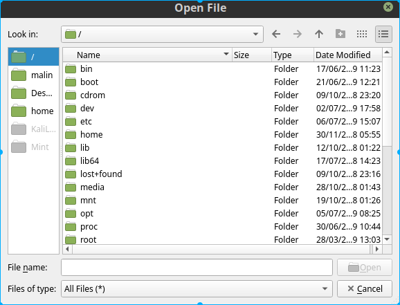

# ELS - Email List Splitter
This tool splits big email lists into custom smaller lists.

Use this tool to split lists, in example to import contacts in popular email relays like SendGrid and MailChimp, where limits for free accounts is up to 2000 emails.

<p align="center">
  
</p>

<br/>
<br/>
<br/>

## Prerequisites

```
No prerequisites, just need to download the right installer for your OS.
Installers currently are available for Windows and Ubuntu users. 
```
---

<br/>

## Installing
If you want to install the tool please follow the below instructions.

```
1. Download the setup file.
```
  - [Windows setup file](Installers/Windows/ELS-win64-setup.exe)
  - [Ubuntu setup file](Installers/Linux/ELS-ubuntu-setup.deb)
```
2. Run and folow the onscreen instructions.
```
```
3. Locate the program shortcut in your OS menu or just search ELS
```

<br/>
<br/>

### Portable version
If you want to try the tool without installing it, just download and unzip the file.

  - [Windows](Portables/Windows_Portable/ELS-Windows.zip)
  - [Ubuntu](Portables/Linux_Portable/ELS-ubuntu.zip)

<br/>
<br/>

## How To

#### 1. Load email list

a)   
b) 

#### 2. Select directory

a)   
b)

#### 3. Select output filetype and emails per list options


```
NOTE: If no selection is made, the default options are 2000 emails per list and txt output file.
```
#### 4. Click Split Now button

<br/>
<br/>

## Built With

* [PyQt5 · PyPI](https://pypi.org/project/PyQt5/) - Python bindings for the Qt cross platform UI and application toolkit
* [FBS](https://github.com/mherrmann/fbs) - Used for freezing and generating installers
* [NSIS](https://nsis.sourceforge.io/Main_Page) - Used to generate Windows installer

<br/>
<br/>

## Contributing

Please read [CONTRIBUTING.md](https://github.com/mmark0v/ELS) for details on our code of conduct, and the process for submitting pull requests to us.

<br/>
<br/>

## Authors

* **Malin Markov** - *Initial work* - [mmark0v](https://github.com/mmark0v/)

<br/>
<br/>

## License

This project is licensed under the GPLv3 License - see the [LICENSE.md](LICENSE.md) file for details

<br/>
<br/>

## Acknowledgments

* Thanks to @mherrmann for developing and sharing his great software FBS and the FBS tutorial

<br/>
<br/>

## Inspiration

As an absolute beginner in python programing I came a cross with a problem that I decided to solve with python.

As part of my daily tasks to share and popularise my website projects I use free trial accounts like SendGrid and MailChimp for my email marketing campains. 

The problem with the trial accounts is that you can add only 2000 emails in your account contact list and every time I start marketing campain I was splitting this huge email lists manually, therefore this splitting tool.

# Thanks for looking at my first project
## Any recommendation or feedback will be much appreciated
